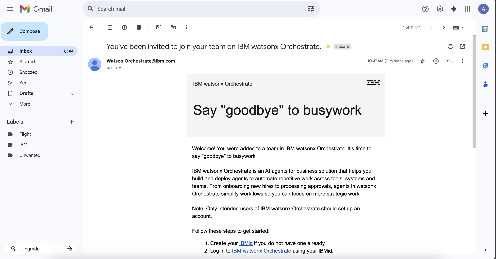
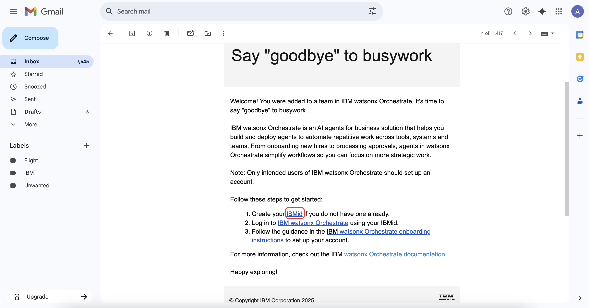
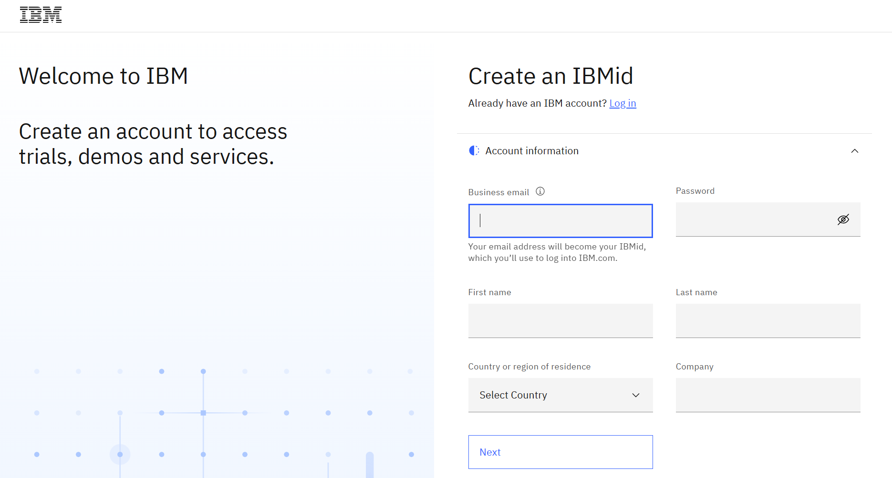
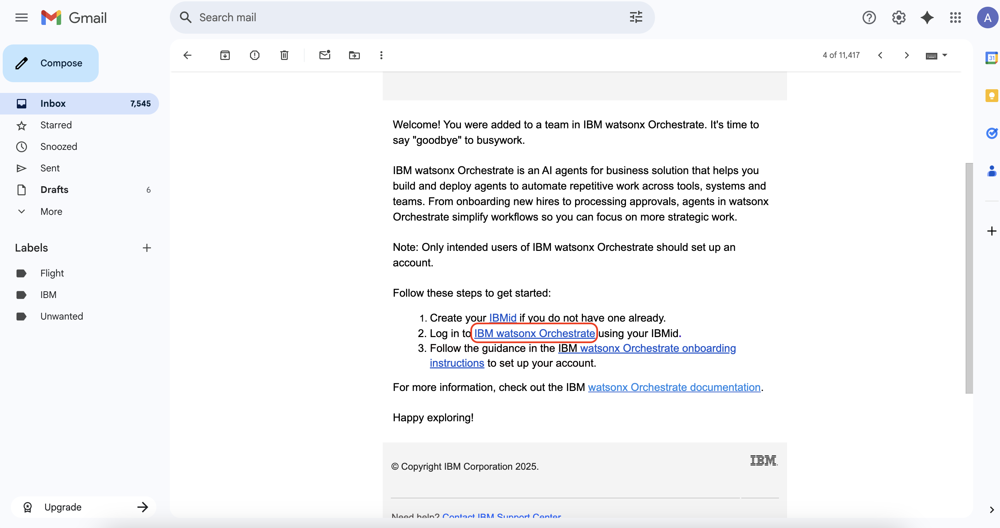
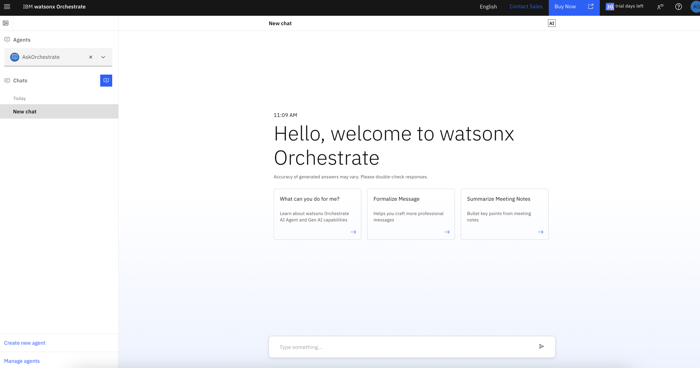

# Set Up

This guide provides step-by-step instructions to set up your development environment and configure **watsonx Orchestrate** for the lab:

### No code lab
1. IBMid registration
2. Join Watsonx Orchestrate Environment

# No Code Lab

## 1. IBMid registration

1.1 Check email subject "You've been invited to join your team on IBM watsonx Orchestrate."

1.2 Click on link "IBMid" (The blue one)

1.2 Fill the required fields present in the Account information section and click Next.

1.3 The email address that you specify in the form is your user name or IBMid.

1.4 Enter the verification code to verify your email ID and click Create account. The IBMid multi-factor authentication enrollment page opens.

1.5 Select your preferred verification method (recommend email method). When completed, the user account is created.

## 2. Join IBM watsonx.orhestrate

2.1 Click on "IBM watsonx Orchestrate" (blue text) on the email as shown on the image.

2.2 Enter the email of your IBMid. Then, click "Continue"

2.3 You should see the image as shown above which means this step is done. ✅✅✅