### Instructions

This lab shows how to create an agent and a simple flow that accepts.

Prerequisites
- Access to the Studio UI where agents and flows are created.

## Steps
1. Create the agent<br/>
    1.1 Choose `create from scratch`<br>
    1.2 Create a new agent named `student_evaluator_agent` <br>
    1.3 Set the description to :<br>
    `This agent used when need to evaluate student's score and behavior report aligning with the standard evaluation criteria, the output will be overall analysis with recommended action based from each student's score and behavior report` 
---

2. Add a Tool that Using a New Flow <br>
    2.1 In the agent settings, open the Toolset section and click **Add tool**.<br>
    2.2 Choose **Create a new flow**.<br>
    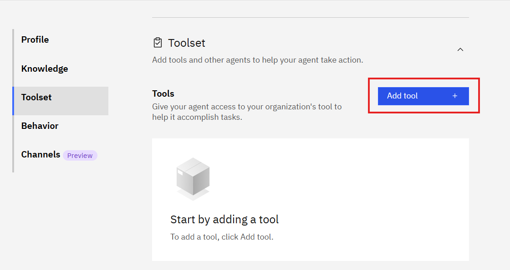
    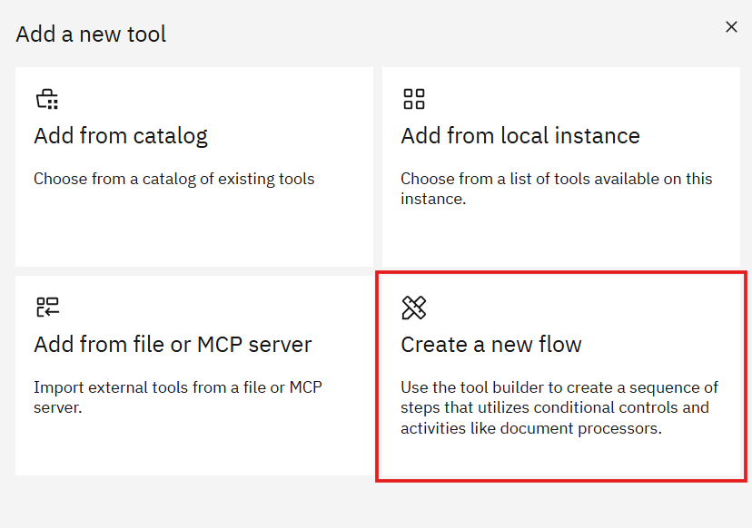

    2.3 Click the flow title (usually `Untitled`) in the top-left to open the flow settings.
    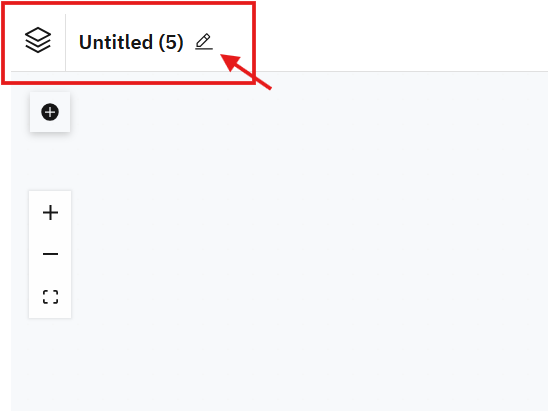

    2.4 Change the tool name to `student_evaluation_tool` and set the description to `This tool analyzes student academic performance, behavior, and activity reports against expected criteria, then generates personalized insights and recommendations to improve the student’s profile.`.<br>
    2.5 Click Save.

    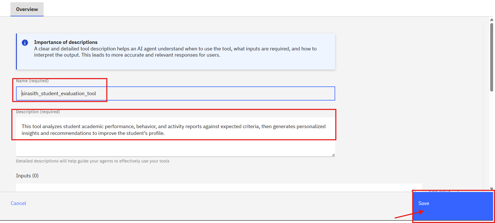
---

#### Create the workflow
1) Add a User Activity node
- Hover over the connection line between Start and End until a plus (+) appears.
- Click the plus icon and select `User activity` from the menu.

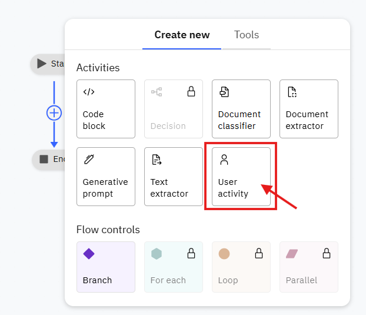
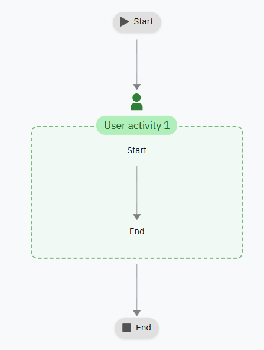

---

2) Ask the user for the Study program
- Edit the User Activity node's display name to: `กรุณากรอกสายการเรียนของนักเรียน`

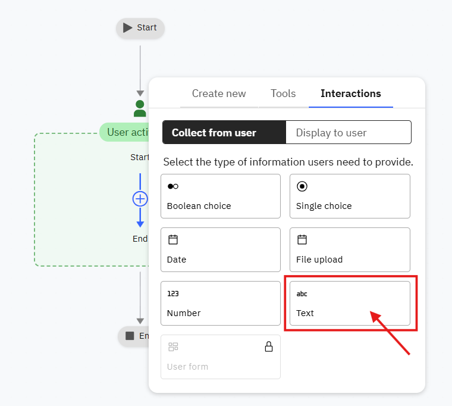

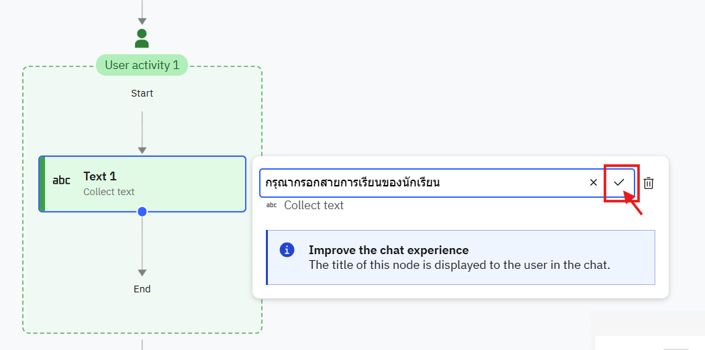

---

3) Add a Generative Prompt inside the User Activity
- Drag a **Generative prompt** into the User Activity node.

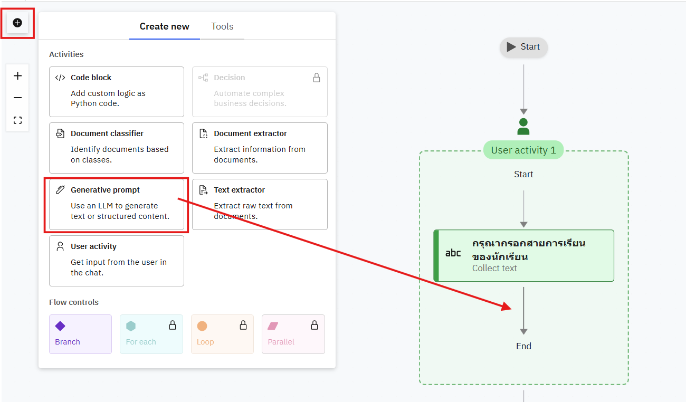

- rename it to **Generative_prompt_expected_criteria**

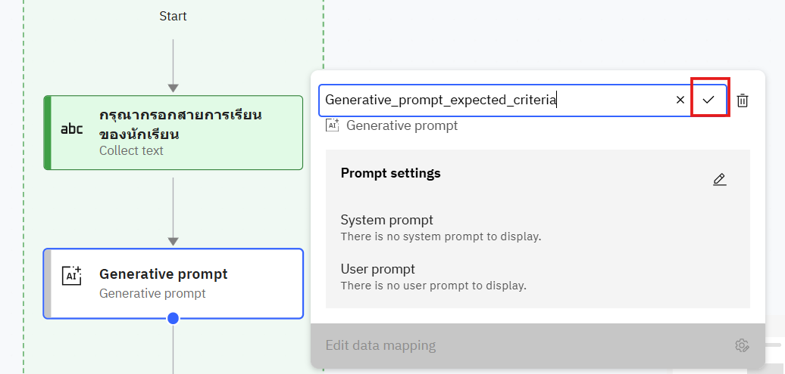

---

4) Configuration for the Generative Prompt<br>
  4.1 Input variable:
    - Name: `study_program`
    - Click `Add` to save the input variable.


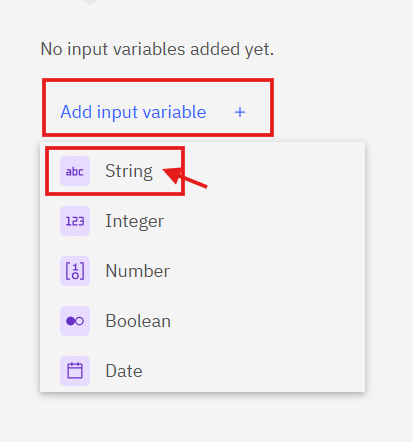


4.2 System prompt (use the exact rules below):

```
Rules:
1. Answer in JSON format only. 
2. You will get student's study program from user query and you will return only related information for that study program. 
3. Do NOT ask any question from user. They will give you a student's study program and you will return JSON only.
4. Ensure all fields are filled with appropriate data and avoid leaving any blank (e.g., 'not specified').
5. For the strength and weakness field, provide in-depth details and a comprehensive description. Do not just include a number or a short phrase. Describe the nature of the strengths and weaknesses required for the study plan (e.g., scores)
```

4.3 User prompt (what the flow will send to the model):
```
study_program: {study_program}
```

You should see similar to this when the prompt is configured:


---

5) Custom Output for the Generative Prompt


5.1 Change object output name to ```expected_criteria ``` with description ```expected_criteria align with student's study program```

Use this JSON schema
```
{
  "strength": {
    "type": "string"
  },
  "weakness": {
    "type": "string"
  }
}
```

Click add button

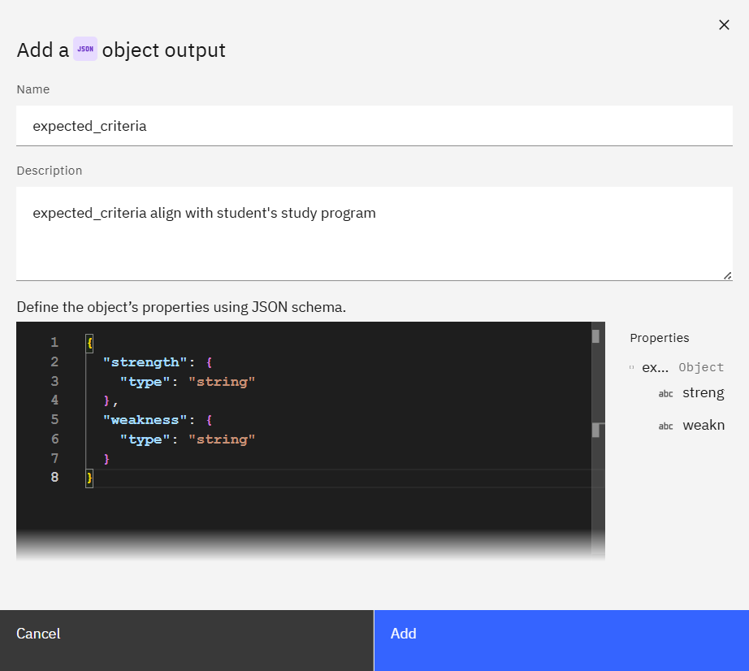

---

- Change the model to ``` llama-4-maverick-17b-128e-instruct-fp8 ```,


---

6) Now Add new flow to upload Student's profile 

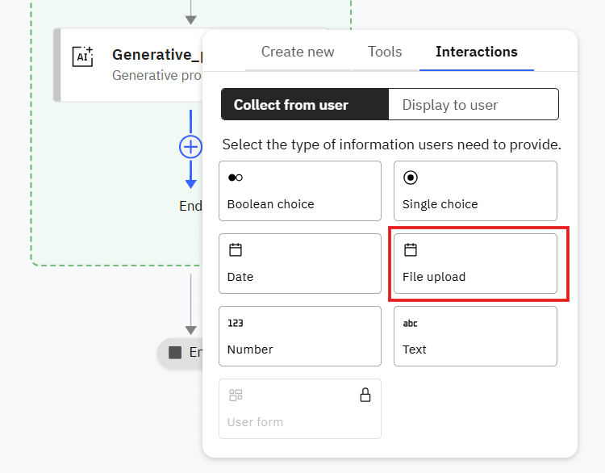

6.1 change name to  **Student profile uploader**

---

7) Add a Document Extractor inside the User Activity<br>
  7.1 Drag a `Document Extractor` into the User Activity node.<br>
  7.2 Rename it to `Student profile extractor`.<br>
  7.3 Click Edit Fields<br>

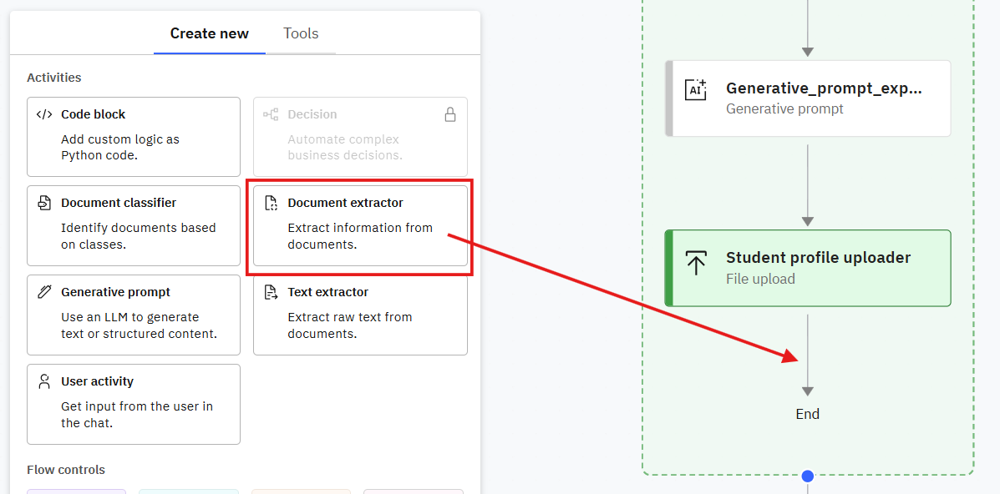

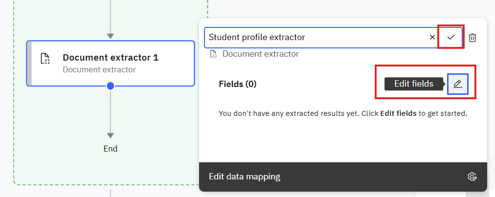


---
8) Download and Upload Sample Document<br>
  8.1 Download student profile from:
    -  `sample/student-report-sample.pdf`<br>

8.2 Upload `student-report-sample.pdf`

8.3 Click **Add Field**, name it as `Student name` and configure the Field


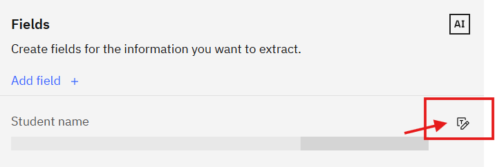

Put Description as 
```
Student name
```


And Click **Back Arrow** top left corner.

8.4 Click **Add Field**, names it as `Student activities` and configure the Field

- For Student activities Using Description as
```
Extract the section(s) related to student activities, extracurriculars, contests, recognitions, or achievements from the student report. Include details such as clubs, competitions, awards, volunteer work, and other notable accomplishments. 

Preserve the original wording exactly as written in the report. Return the result as a single combined text string.
```

8.5 Click **Add Field** names it as `Student behavior` and configure the Field

- For Student behavior Using Description as
```
Extract the entire section labeled "Behavior & Attitude" (or equivalent)  
from the student report. Include all bullet points or sentences related to 
class participation, discipline, teamwork, punctuality, overall conduct, 
or similar behavioral descriptions. 

Preserve the original wording exactly as written in the report. 
Return the result as a single combined text string.
```

8.6 Click **Add Field** names it as `Student total score by subject` and configure the Field

- For Student total score by subject Using Description as
```
Extract the academic performance of the student by subject. Include the subject name final score, total score out of 100, and the grade. Ensure that all values are captured exactly as presented in the report.
```

---

## Checkpoint: Current Workflow would be similar like this
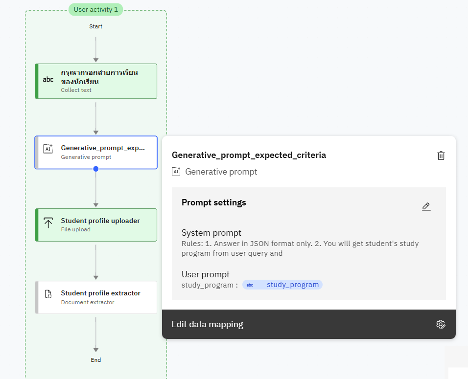
<br>

<br>

---

9. Drag Generative prompt into user flow name it as `scoring agent` Click Edit prompt settings<br>

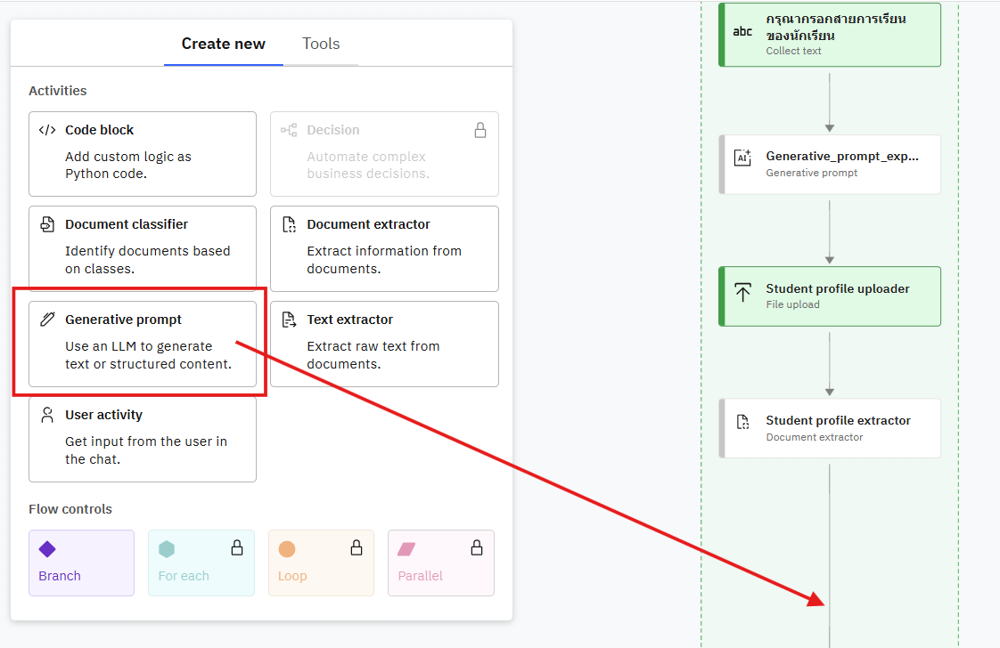

9.1  Click **Add input variable** and select variable type as **String**

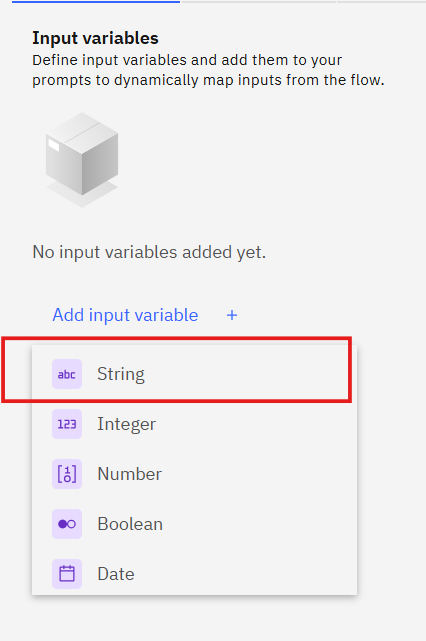

9.2 Name the input variable. Repeat this process for all required variables:

- `Student_name`  
  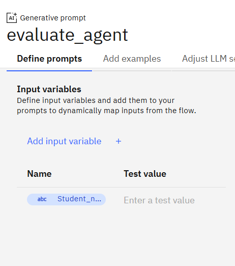
- `Student_behavior`
- `Student_acitivites`
- `Student_total_score_by_subject`
- `expected_criteria_strength`
- `expected_criteria_weakness`

9.3 For each variable:  
- Click **Add input variable**  
- Choose **String** as the type  
- Enter the variable name  
- Click **Save/Add**  

9.4 After adding all variables, your Generative Prompt input variables should include:

  

9.5 Add this into System prompt exactly
```
You are an AI Educational Analyst.  
You will receive:  
- Student profile: name, behavior, activities, and scores  
- Expected criteria: strength and weakness  

The output must always include:  
- Strengths  
- Weaknesses / Risks  
- Developmental Insights  
- Recommendations  
Respond in Markdown format.
```
 
9.6 Add user prompt as
```
Candidate: 
- name={Student_name}
- behavior={Student_behavior}
- activity log={Student_activities}
- score={Student_total_score_by_subject}

Expected Criteria:
- Strengths: {expected_criteria_strength}
- Weaknesses: {expected_criteria_weakness}

Task:
Analyze this candidate by comparing the actual student profile against the expected criteria. Provide insights for improvement with action plans.
```

The output should be as

  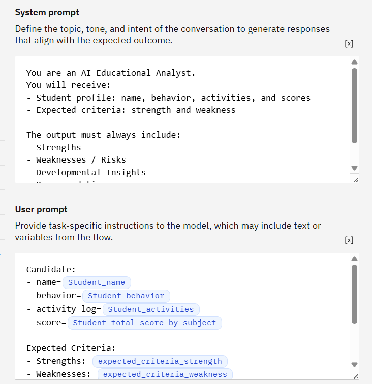

9.7 Change the Model to **llama-4-maverick-17b-128e-instruct-fp8**

  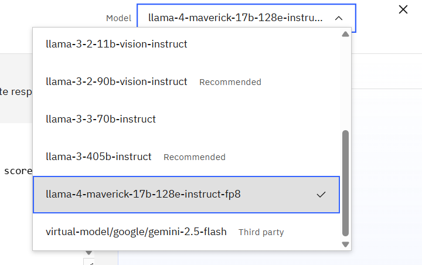

  This is lastest workflow then click **done** on top right corner

  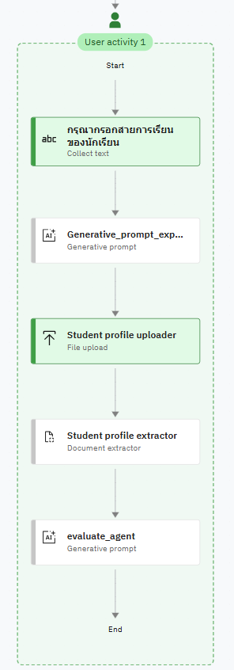

  ---
13 Change the main Model to **llama-3-405b-instruct / gemini-2.5-flash**

  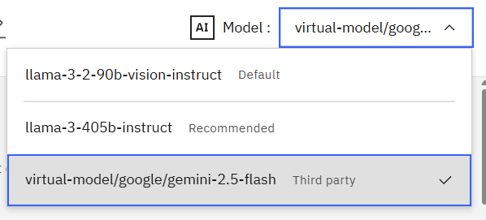

14 Scroll down to **Beheavior Section** and add this instructions:
```
Whenever the user asks to analyze, review, or get recommendations for a student profile, report, scores, behavior, or activities, use the "Student_evaluation_tool" to process the input. The output must be in Thai and must include the following:
- Recommendations for the student, highlighting the areas of development.
- Bloom's Taxonomy analysis based on the student's cognitive skills (Application, Analysis, etc.).
- Erikson’s Psychosocial Stages analysis based on the student's psychosocial development and behaviors.
- The analysis should highlight the alignment of the student with Bloom's Taxonomy and Erikson’s Stages, with specific recommendations for improvement.
```
  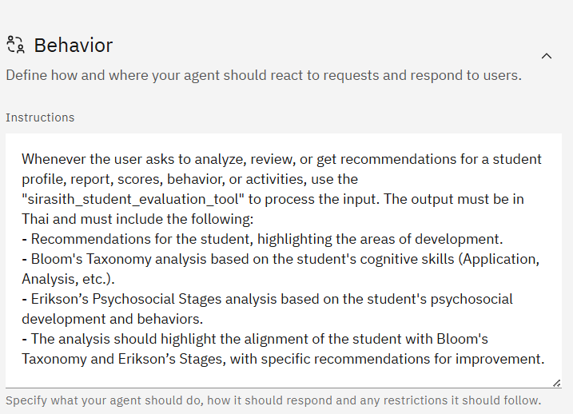
---

  ### Testing
  
  - `อยากประเมิน profile ของนักเรียน`

- Answer with
```
math and science
```

  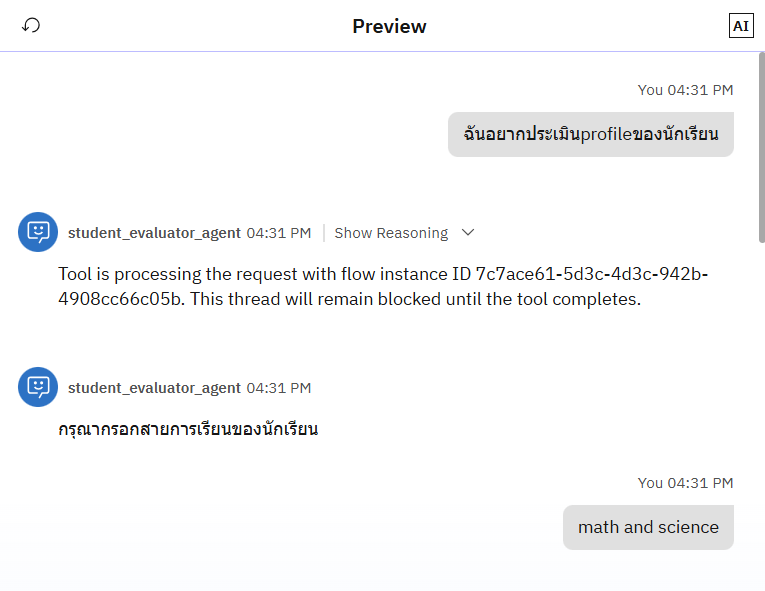

- The Agent will allow you to upload Student profile, upload pdf from```test/student_report_Alice.pdf```

## Example

  

  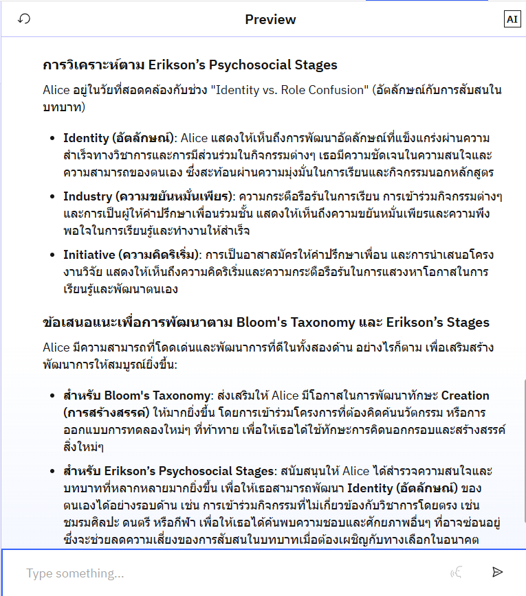


